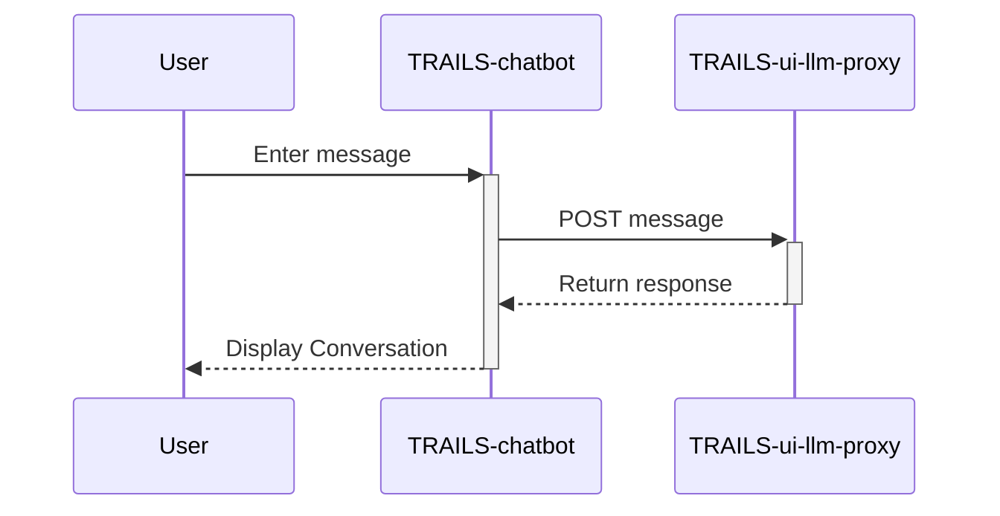

# TRAILS Chatbot Auditing Tool

This is the chatbot auditing interface using the Material-UI for the frontend interface.
The chatbot auditing tool communicates with the [TRAILS-ui-llm-proxy](https://github.com:gwusec/TRAILS-ui-llm-proxy.git). 

## Setup

1. Ensure [Node.js](https://nodejs.org/) (v14 or higher)

2. Clone repository:

    ```bash
    git clone git@github.com:gwusec/TRAILS-Chatbot.git
    cd TRAILS-Chatbot
    ```

3. Install dependencies:

    ```bash
    npm install
    ```

## Development

### Option 1 - Dev without proxy server (default)

1. Add required environment variables to `.env` file:
   ```bash
    touch .env
    echo "DEV_SERVER_PORT=3100" >> .env
    echo "MOCK_SERVER_PORT=3110" >> .env
    ```
2. Run the chatbot with mock server
    ```bash
    npm run start-with-mock
    ```

The application should open in your web browser.


### Option 2 - Dev with proxy server

1. Setup and run [TRAILS-ui-llm-proxy](https://github.com:gwusec/TRAILS-ui-llm-proxy.git)
1. Add required environment variables to `.env` file:
   ```bash
   touch .env
   echo "DEV_SERVER_PORT=3100" >> .env
   echo "REACT_APP_LLM_PROXY_HOST_AND_PORT='localhost:3110'" >> .env
   ```
3. Run the chatbot
    ```bash
    npm run start
    ```

## Understanding the Data Flow

The application's data flow involves the frontend sending user messages to the backend, which then interacts with the Ollama model to generate responses. These interactions are logged in a MongoDB database for session persistence and history retrieval.

### Data Flow Diagram



## Event API

### `trails-chatbot:audit-finished`

The `trails-chatbot:audit-finished` custom event is dispatched by the `ExportManager` component when the user clicks the "Finish audit and proceed with survey" button. This event is used to notify other parts of the application that the audit process has been completed and the exported data is available.

**Event Name:** `trails-chatbot:audit-finished`

**Event Type:** `CustomEvent`

**Bubbles:** `true`

**Cancelable:** `true`

**Detail:** The event detail contains the exported conversation data, which is an object with the following structure:

```json
{
  // conversation data properties
}
```

## Deployment

### Embed component in parent React application

The chatbot can be embedded into a parent application, allowing you to control the user interface and user experience around the chatbot. To do so, you can import the `App` component from the `trails-ui-chatbot` package and use it as a component in your parent application.

Here is an example of how you can embed the chatbot in a parent application:

`package.json`
```json
{
  "dependencies": {
    "trails-ui-chatbot": "github:gwusec/TRAILS-Chatbot#main"
  },
}
```

`ParentApp.jsx`
```javascript
import { App as Chatbot } from "trails-ui-chatbot";

export default function ParentApp() {

    const authorizedUser = 'id_of_some_authorized_user'; // this will be sent to the proxy, as the proxy uses an allow list
    const publicLlmProxyServerUrl = 'https://my-host.com/proxy'; // public url where the proxy is reachable

    async function handleReturnChatbot(data){
        const exportedData = event.detail;
        // Process the exported data as needed
    }

    useEffect(() => {
        // add listener
        document.addEventListener('trails-chatbot:audit-finished', handleReturnChatbot);

        // cleanup
        return () => {
            document.removeEventListener("trails-chatbot:audit-finished", handleReturnChatbot);
        }
    }, [])

    return (
        <Chatbot
            userId={authorizedUser}
            llmProxyServerUrl={publicLlmProxyServerUrl} 
            debugMode={false} // should be false in deployment
            config={{
                timerMaxOverallChatTimeSeconds: 15 * 60, // 15 minutes in seconds
                timerChatsMaxSeconds: [7 * 60, 5 * 60],  // 
                timerAuditMaxSeconds: [],          // audit: first 1.5 min (90s), second 1 min (60s)
                timerWarningChatTimeIsUpSeconds: 2 * 60,    // show warning with 2 min left in a chat
                timerMinChatTimeRemainingToStartNewChatSeconds: 3 * 60, // need at least 3 min left to start a new chat
            }}
        />
    )    
}
```