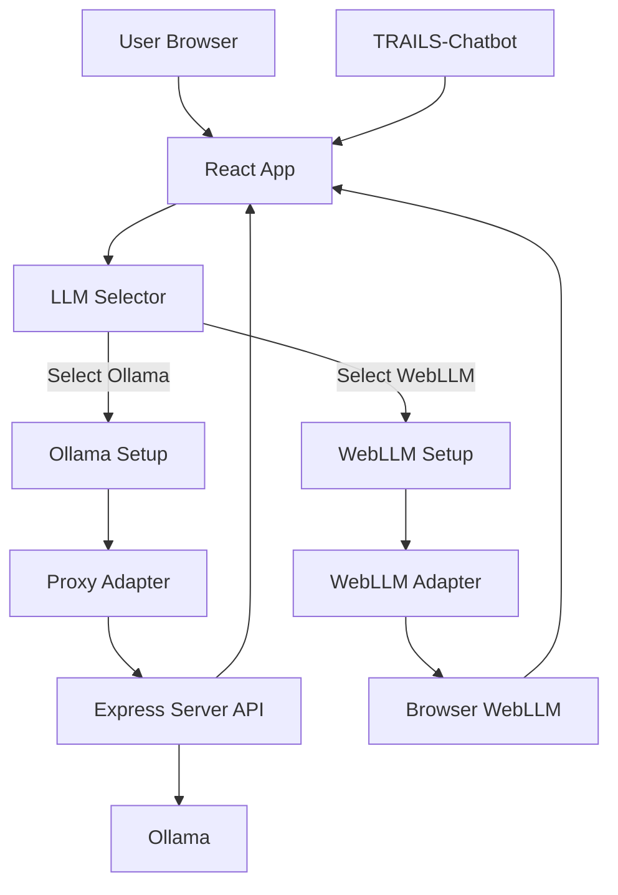
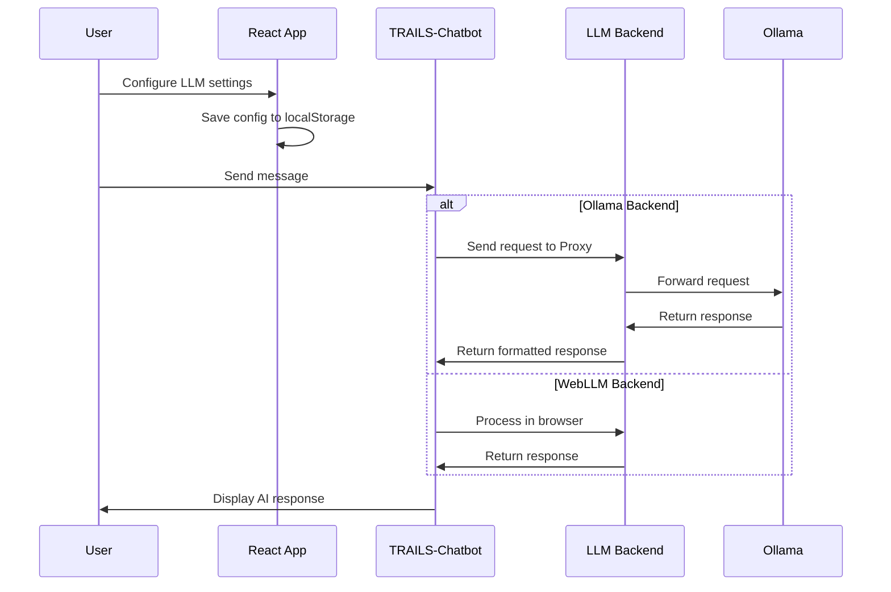
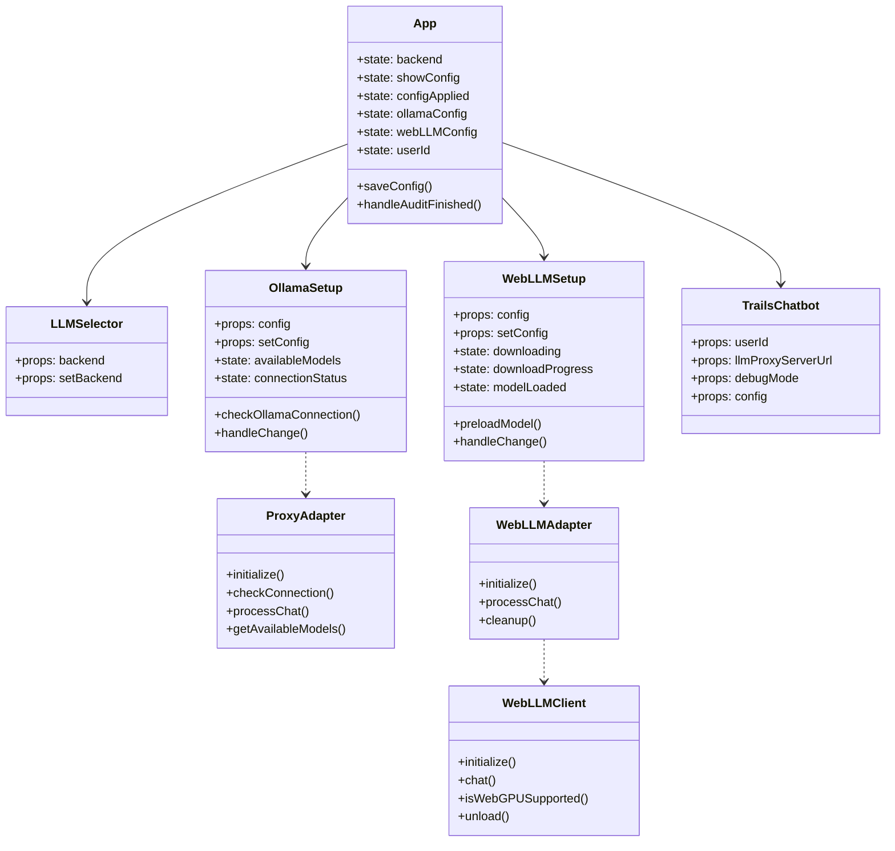

# TRAILS-Website

A wrapper application for the TRAILS Chatbot that provides multiple LLM backend options.

## 📋 Table of Contents

- [Features](#features)
- [System Architecture](#system-architecture)
- [Directory Structure](#directory-structure)
- [Prerequisites](#prerequisites)
- [Installation](#installation)
- [Usage](#usage)
- [Local Production Testing](#local-production-testing)
- [Render Deployment](#render-deployment)
- [Backend Options](#backend-options)
- [OpenAI Setup](#openai-setup)
- [Ollama Setup](#ollama-setup)
- [Deployment Limitations](#deployment-limitations)
- [Go-Live Checklist](#go-live-checklist)
- [Implementation Details](#implementation-details)
- [Troubleshooting](#troubleshooting)
- [License](#license)

## ✨ Features

- Use the TRAILS Chatbot with multiple LLM backend options:
  - **Ollama**: Run models locally through Ollama
  - **WebLLM**: Run models directly in your browser
  - *(Coming soon)* Support for API keys (OpenAI, Claude, Gemini)
- Simple and intuitive user interface
- Configurable settings for each backend
- Persistent configuration

## 🏗️ System Architecture

### Component Diagram



### Data Flow Diagram



### Component Relationship Diagram



## 📁 Directory Structure

```
TRAILS-Website/
├── public/                          # Static files
│   ├── index.html                   # HTML template
│   ├── manifest.json                # Web app manifest
│   ├── robots.txt                   # Robots file
│   ├── favicon.ico                  # Website favicon
│   ├── ollama-logo.png              # Ollama logo for UI
│   └── webllm-logo.png              # WebLLM logo for UI
│
├── src/                             # Source code
│   ├── components/                  # React components
│   │   ├── adapters/                # LLM backend adapters
│   │   │   ├── ProxyAdapter.js      # Adapter for proxy server
│   │   │   └── WebLLMAdapter.js     # Adapter for WebLLM
│   │   │
│   │   ├── LLMSelector.jsx          # LLM selection component
│   │   ├── LLMSelector.css          # Styles for LLM selector
│   │   ├── OllamaSetup.jsx          # Ollama configuration component
│   │   ├── OllamaSetup.css          # Styles for Ollama setup
│   │   ├── WebLLMSetup.jsx          # WebLLM configuration component
│   │   └── WebLLMSetup.css          # Styles for WebLLM setup
│   │
│   ├── utils/                       # Utility functions
│   │   └── WebLLMClient.js          # WebLLM client utilities
│   │
│   ├── App.jsx                      # Main application component
│   ├── App.css                      # Styles for main app
│   ├── index.js                     # Application entry point
│   └── index.css                    # Global styles
│
├── .babelrc                         # Babel configuration
├── config-overrides.js              # React-app-rewired config
├── server.js                        # Express server for API proxy
├── package.json                     # Project dependencies and scripts
└── README.md                        # Project documentation
```

## ✅ Prerequisites

- [Node.js](https://nodejs.org/) (v16 or higher)
- [npm](https://www.npmjs.com/) (v8 or higher)
- **Important**: This project requires **React 19** due to the TRAILS-Chatbot dependency
- For Ollama backend:
  - [Ollama](https://ollama.ai/) installed and running
  - LLM models pulled with Ollama (e.g., `ollama pull llama3`)

## 🚀 Installation

1. Clone this repository:
   ```bash
   git clone https://github.com/your-username/TRAILS-Website.git
   cd TRAILS-Website
   ```

2. Install dependencies:
   ```bash
   npm install
   ```

3. Add the favicon and logo files to the public directory:
   ```bash
   cd public
   curl -o favicon.ico https://raw.githubusercontent.com/facebook/create-react-app/main/packages/cra-template/template/public/favicon.ico
   curl -o ollama-logo.png https://ollama.com/public/ollama.png
   curl -o webllm-logo.png https://raw.githubusercontent.com/mlc-ai/web-llm/main/site/img/webllm-logo.png
   cd ..
   ```

## 🖥️ Usage

### Development Mode

Start both the React app and the proxy server:
```bash
npm run dev
```

The application will be available at:
- React dev server: http://localhost:3001
- API server: http://localhost:3000

### Production Mode

1. Build the React app:
   ```bash
   npm run build
   ```

2. Run the production server:
   ```bash
   npm run prod
   ```

The application will be available at http://localhost:3000.

## Local Production Testing

1. Copy environment variables:
    ```bash
    cp .env.example .env
    ```

2. Build the frontend:
    ```bash
    npm run build
    ```

3. Start the production server:
    ```bash
    npm run start
    ```

4. Verify health endpoint:
    ```bash
    curl http://localhost:3000/api/health
    ```

## Render Deployment

Deploy this repository as a single Render Web Service (frontend build + Express relay in one service).

1. Push this repository to GitHub.
2. Create a new Web Service in Render from your repository.
3. Set environment:
    - `NODE_ENV=production`
    - `ALLOWED_ORIGINS=https://<your-render-domain>.onrender.com`
    - Optional tuning values from `.env.example`
4. Set commands:
    - Build Command: `npm install && npm run build`
    - Start Command: `npm run start`
5. Deploy and test:
    - `GET /api/health`
    - Open app URL and run one OpenAI request and one Ollama request.

Notes:
- Render injects `PORT` automatically; the server already binds to `process.env.PORT`.
- Static build is served by Express in production.

## 🔧 Backend Options

### Ollama

[Ollama](https://ollama.ai/) allows you to run large language models locally. The website communicates with Ollama through a proxy server.

To use Ollama:
1. [Install Ollama](https://ollama.ai/download)
2. Pull your desired model: `ollama pull llama3`
3. Run Ollama: `ollama serve`
4. Configure the Ollama URL and model in the website settings

### API Key

Users can supply their own API keys. Requests are relayed through the Express backend and routed per request.

Supported providers in the relay:
- OpenAI
- Anthropic
- Cohere
- Gemini

## OpenAI Setup

1. Choose `API` mode in the UI.
2. Provider: `openai`.
3. Base URL: `https://api.openai.com/v1`.
4. Model: e.g. `gpt-4o`.
5. Paste user-owned API key.

The relay does not require server-side model hosting for OpenAI mode.

## Ollama Setup

For a public website, users should provide an Ollama endpoint reachable by the deployed server.

Common pattern:
1. User runs local Ollama:
    ```bash
    ollama serve
    ollama pull llama3.1
    ```
2. User exposes local Ollama with a tunnel (for example Cloudflare Tunnel or ngrok).
3. User pastes the tunnel URL into the Ollama URL field.

Important:
- The relay is request-scoped and uses the Ollama URL provided in each request.
- There is no server-hosted model fallback in production behavior.

## Deployment Limitations

1. This deployment intentionally does not host any model server.
2. Ollama mode requires a user-provided endpoint that is reachable from the deployed relay.
3. Private/local Ollama endpoints can be blocked by policy (`ALLOW_PRIVATE_OLLAMA_URLS=false` by default).
4. Free hosting tiers may cold-start and increase first-response latency.

## Go-Live Checklist

1. Confirm `.env` is set from `.env.example`.
2. Set `ALLOWED_ORIGINS` to your production domain(s).
3. Keep `ALLOW_PRIVATE_OLLAMA_URLS=false` unless you have a trusted private deployment.
4. Validate `/api/health` returns status `ok`.
5. Validate rate limiting by sending repeated `/chat` requests and checking `429` behavior.
6. Validate OpenAI mode with a user-owned key.
7. Validate Ollama mode with a user-owned reachable endpoint URL.
8. Confirm logs do not expose full API keys.
9. Confirm frontend static assets are served from Express in production.
10. Verify restart behavior and error handling on failed provider calls.

### WebLLM

[WebLLM](https://mlc.ai/web-llm/) runs models directly in your browser using WebGPU. The model will be downloaded the first time you use it.

To use WebLLM:
1. Make sure you're using a WebGPU-compatible browser (Chrome/Edge recommended)
2. Select WebLLM in the website settings
3. Choose your desired model
4. Wait for the model to download

## 📝 Implementation Details

### Adapter Pattern

The application uses the Adapter pattern to provide a consistent interface to different LLM backends:

1. **ProxyAdapter**: Handles communication with the Express server, which forwards requests to Ollama
2. **WebLLMAdapter**: Wraps the WebLLM client for browser-based inference

### Configuration Management

Settings are stored in the browser's localStorage, including:
- Selected backend (Ollama/WebLLM)
- Backend-specific configurations
- Model selections

### React 19 Compatibility

The TRAILS-Chatbot component requires React 19, which is still in alpha/beta. The application is configured to use React 19 to ensure compatibility.

## ❓ Troubleshooting

### Common Issues

1. **Port Conflicts**: If port 3000 or 3001 is already in use:
   - Change the port in package.json scripts
   - Update the proxy configuration accordingly

2. **React Version Conflicts**: If you see useState or other React hooks errors:
   - Ensure you're using React 19 as specified in package.json
   - Run `npm install` to ensure all dependencies are correctly installed

3. **Ollama Connection Issues**:
   - Verify Ollama is running with `ollama serve`
   - Check the Ollama URL in your settings
   - Make sure you've pulled the model you're trying to use

4. **WebLLM Browser Compatibility**:
   - Ensure you're using a browser with WebGPU support (Chrome/Edge recommended)
   - Check console for WebGPU-related errors

### Debug Tips

1. Check the browser console for errors
2. Examine the server logs for API-related issues
3. Use the network tab to inspect request/response patterns
4. Try different models to isolate issues

## To create dockers for deployement

setup ssh for importing private github file:

```bash
ssh -T git@github.com 
eval "$(ssh-agent -s)"    
ssh-add --apple-use-keychain ~/.ssh/id_ed25519       
ssh-add -l  
```


Create a docker image to test:

for your own machine:

```bash
docker build --ssh default -t chatbot:test .
docker run --rm -p 3000:3000 --add-host host.docker.internal:host-gateway chatbot:test
```

for different architectures and save it locally:

```bash
docker build --ssh default --platform linux/arm64 -t chatbot:arm64 .
docker run --rm -p 3000:3000 --add-host host.docker.internal:host-gateway chatbot:arm64
docker build --ssh default --platform linux/amd64 -t chatbot:amd64 .
docker run --rm -p 3000:3000 --add-host host.docker.internal:host-gateway chatbot:amd64
```

to compress them:

```bash
docker save chatbot:arm64 | gzip > chatbot_arm64.tar.gz
docker save chatbot:amd64 | gzip > chatbot_amd64.tar.gz
```